# A New Way to Study Animals in Remote Environments Enabled by Satellites and Machine Learning.  
<center>
  
</center>  
  
<center>  
  
This camera enables flexible study of animals in areas with poor cellular reception, such as the mountain ranges of Colorado, or rural farmland.  
  
</center>  
  
## Intro  
  
> “Chronic wasting disease (CWD) is a serious disease in animals such as deer, elk, moose, and reindeer. Since first reported in the United States, CWD has spread to animals in more than half of the states in the continental United States. It is always fatal in infected animals. There is no vaccine or treatment. CWD is a type of prion disease.” - [CDC](https://www.cdc.gov/chronic-wasting/animals/index.html)  
  
<center>  
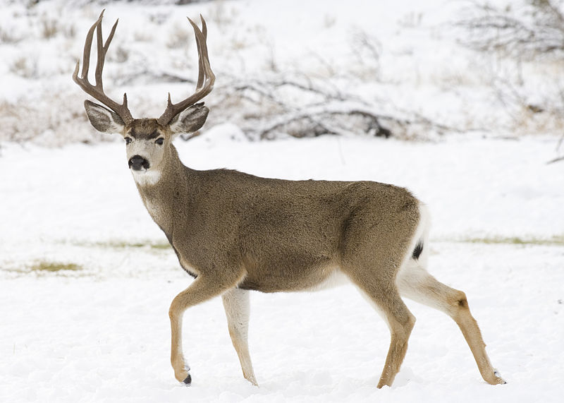  
</center>  
  
<center>A healthy looking Deer Mule.</center>  
  
<center>  
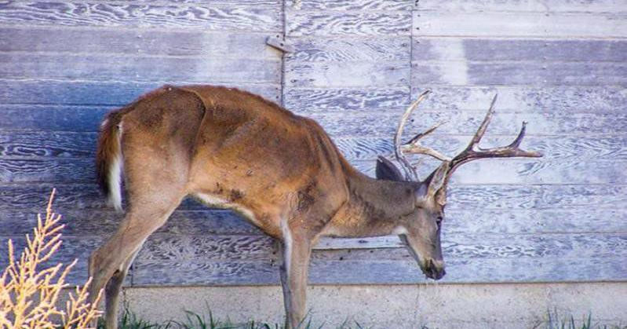  
</center>  
  
<center>A diseased deer with CWD that can clearly be identified as potentially being infected due to its wasted away appearance.</center>  
    
</br>  
  
Studying and mitigating **C**hronic **W**asting **D**isease (**CWD**) can prove challenging in animal populations. It’s [difficult to incentivize hunters](https://dnr.illinois.gov/content/dam/soi/en/web/dnr/programs/cwd/documents/cwd-fact-vs-fiction.pdf) to volunteer their efforts as they go about chasing a prized game animal. Hunters have to volunteer tremendous effort, time, and cost to assist. In addition, due to the nature of remote environments, it’s [difficult to collect and send data](https://www.ncbi.nlm.nih.gov/pmc/articles/PMC5004924/). Any given state’s local **D**epartment of **N**atural **R**esources (**DNR**) has limited resources and it can be difficult to plan where to expend those resources on managing CWD.  
  
Colorado for example has continuously struggled with CWD within their deer, elk, and moose populations. Recently they found an increase in certain populations like the [White River herd](https://www.gjsentinel.com/news/western_colorado/chronic-wasting-disease-battle-continues/article_3f3e09e2-321a-11ee-a836-bb106b337e90.html) in [White River National Park](https://www.fs.usda.gov/whiteriver). The terrain can prove challenging to navigate and cell signal is not guaranteed usually due to the deep valleys from large surrounding mountains that block signal.  
  
A trail camera that performs extremely well under constrained cell signal conditions can help collect data to further study and make more informed and timely decisions when planning and managing CWD within animal populations. For the case of Colorado, this trail camera can collect data about animals within valleys via satellite and be moved to ridge lines of surrounding mountains where cell signal is present to send the images.  
  
Local DNR can set up and move multiple cameras themselves or try to incentivize local hikers to move cameras to be more efficient and save cost. Cameras could be continuously rotated between ridgelines and valleys for when data needs to be collected. Thanks to the use of satellite data transmission, it can be easily figured out when these cameras should be rotated to a different location for either uploading the data or collecting more data.  
  
<center>  
  
</center>  
  
## How does it work? Let's Walk Through an Example!
Let's use Pascal, our corgi friend, as an example. He's standing in for a deer, wearing antlers and laying in front of the trail camera. The camera detects movement by comparing images with [difference hashes](https://github.com/JohannesBuchner/imagehash/blob/37370215df467c3940d6d378edb44ae56114b6a7/imagehash/__init__.py#L304C1-L304C5) or using a PIR sensor. Once Pascal is in front of the camera, these methods help detect his presence and determine when to save an image.  
<center>  
  
</center>  
  
The metadata from the original image is sent via satellite using the [Starnote](https://blues.com/starnote/) notecard to [Notehub](https://blues.com/notehub/) and then routed to a [Django](https://www.djangoproject.com/) web app hosted at [https://cwd.enhancetheimage.com](https://cwd.enhancetheimage.com).  
  
<center>  
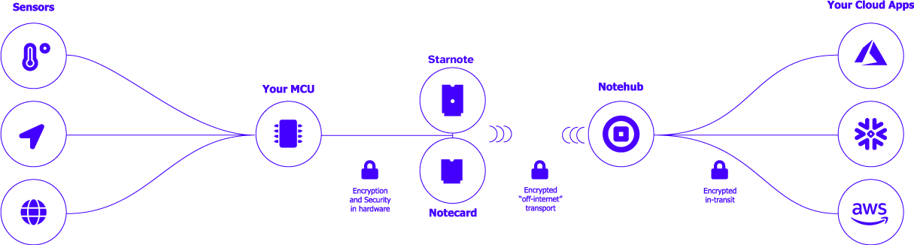  
</center>  
  
The data sent includes:  
  
```json  
{
    "img_dhash": "0e2e0e0e0e6ec607",
    "h_dist": 8,
    "loc": "6FG22222+22"
}
```    

Images that look perceptually similar also have similar hashes. The measure of similarity or dissimilarity between these hashes is called the `Hamming distance`, labeled as h_dist in the metadata. This value is calculated by comparing a periodically taken image's difference hash to a more frequently taken image's difference hash. The greater the difference between the images, the higher the `Hamming distance` value. This helps determine how much of the camera's field of view is obscured by whatever triggered the recording, providing insight into how interesting the image might be for further inspection.

Knowing the `Hamming distance` allows us to decide whether to remotely download the image or take other actions regarding the trail camera. It also reduces false positives by preventing unnecessary alerts from the camera being overly sensitive to movement.

When enough images accumulate on the trail camera, we can either move it ourselves or ask someone to relocate it to an area with cell reception. We can also gauge the number of stored images and get a sense of their quality.

On the web app, we can request to download Pascal's image if the `Hamming distance` is above 3, which, in a static environment, often indicates something worth inspecting.
  
<center>  
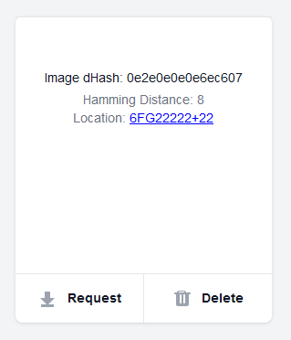  
</center>    
  
Once a request is sent, the web application sends a command back to the [Starnote](https://blues.com/starnote/) via satellite for a specific image:  
  
```json  
{
    "img_dhash": "0e2e0e0e0e6ec607",
    "method": "cell"
}
```    
  
<center>  
  
</center>  
  
When the hardware receives the request, the image is resized from its original `480x640` (500KB+) `.PNG` format to a `120x160` (10KB) `.JPEG`. The **resolution is reduced by a factor of four** in both width and height, and the change in file format results in a **50x** reduction in file size. This smaller `.JPEG` is then sent over cellular data.  

<center>  
  
</center>  
  
You can see the `.JPEG` stretched back to its original resolution for comparison, revealing a loss of quality and visible compression artifacts.  
  
<center>  
  
</center>  
  
The hardware converts the `.JPEG` to a `base64` encoded image and breaks it into chunks for reliable transmission. The chunks and the status of sent images are tracked in `IMAGES_SENT.json`. Once the web application receives all the chunks for an image, it reassembles and displays it. An example json message is shown below:  
  
```json  
{
    "b64_chunk_total": 54,
    "b64_img_chunk": "qLuc86dpWOO1a9l1TUprybhpWyF/ujsPwFdl8O9J8uKXVZl+Z8xQ59P4j+J4/A1y",
    "chunk_index": 39,
    "img_dhash": "0e2e0e0e0e6ec607"
}
```  
  
<center>  
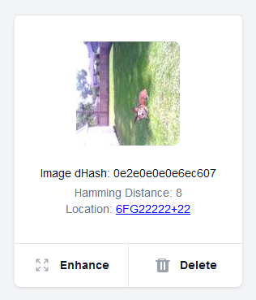  
</center>  
    
Pascal is now made whole again. However, he's still fairly low resolution and hard to see. What's great is that the web application makes use of a model called `xenova/swin2SR-realworld-sr-x4-64-bsrgan-psnr` to bring the resolution up on the client side via a library called [`transformers.js`](https://huggingface.co/docs/transformers.js/en/index). You trigger this functionality through the `Enhance` button. A model to upscale images to save on data transmission costs and create a better user experience is by far the most underrated science fiction to become a possibility in recent years.  
  
<center>  
  
</center>  
  
It does a sufficient job of making the small image clearer. Despite some loss of detail, it's still possible to discern whether an animal's ribs are visible or if its spine alters its silhouette, which could indicate CWD, a different disease, or malnourishment. This model increases the resolution by `4x`, allowing us to send lower-resolution images, save data, and reduce transmission costs.  
  
<center>  
  
</center>  
  
Pascal now has an airbrushed appearance, but it's clear he is a well-fed good boy. While some detail is lost, the edges and shadows are preserved well enough to check for visible ribs or spine. This is notable, given how little of the image he occupies. The same process could be used to count deer, elk, and moose suspected of having CWD, helping the DNR track the spread of the disease and allocate resources more effectively.  
  
## Getting Started with Wiring and Securely Mounting Electronics  
When working on a project like this, I prefer to start by setting up the hardware. This approach makes troubleshooting easier, as it eliminates concerns about loose wiring. Begin by removing the plastic pegboard, which will be used to mount all components. This pegboard is included with the junction box and can be securely attached to the back of the box using the provided screws.  
<center>  
  
</center>  
  
Set that off to the side and then solder the QWIIC shim board to the Orange Pi.  
<center>  
  
</center>  
  
This QWIIC shim board is used to communicate over I2C to the Notecard Carrier XS. Each socket in the carrier will correspond to a specific notecard that allows us to communicate over satellite or cell transmission for each respective notecard. We'll be using QWIIC cables to cut down on the required soldering for this project. There is good documentation to reference for assembling the notecarrier XS. It's mostly intuitive, but which connector goes to what antenna wire isn't always something that's easy to remember. You can check that out over [here for the satellite notecard](https://dev.blues.io/quickstart/starnote-quickstart/#connecting-a-starnote) and [here for the cell notecard](https://dev.blues.io/quickstart/notecard-quickstart/notecard-and-notecarrier-f/).  
<center>  
  
</center>  
  
For convenience, here are the images for wiring up antennas taken from Blues's documentation.  
<center>  
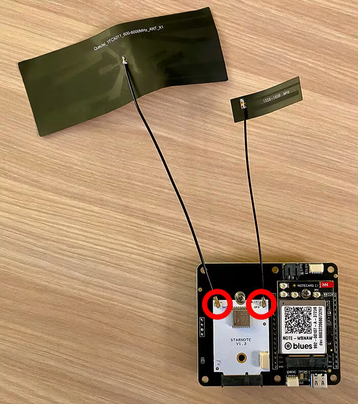  
</center>  
<center>  
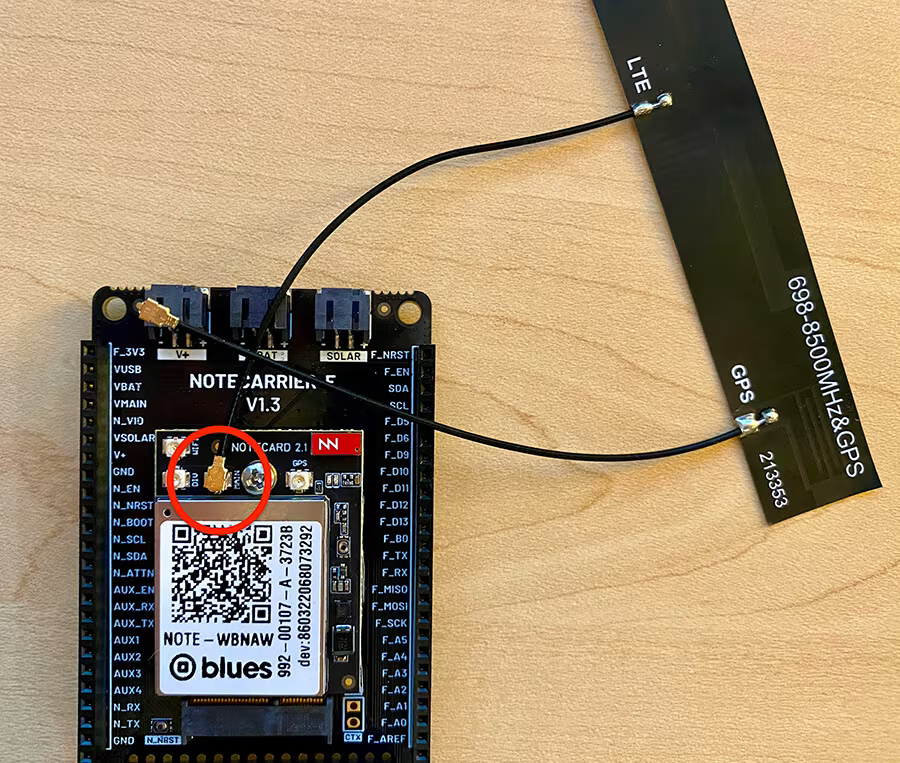  
</center>  
  
Next we'll connect a ribbon cabble to a 24 pin breakout board to make it easier to solder connections. We'll be using this to solder the web camera that uses a set of 4 wires that act like a USB device.  
<center>  
  
</center>  
  
This is how we wire the web camera and the relevant pin numbers to use.  
<center>  
  
</center>  
  
We can start mounting some electronics on the peg board using nylon standoffs and screws that are M3. We can also use some zip ties to make sure nothing moves and hide some of the wiring on the other side. The web camera can be secured within the center of the peg board with a single zip tie as long as nothing crosses its field of view. The LM2596 DC-DC Step Down board can be mounted with the nylon M3 fasteners and 2 18650 battery holders can be held in place with zip ties to be soldered together in series. You can see the wiring drawn in below to make it more clear how to do that.  
<center>  
  
</center>  
  
Now mount the rest of the electronics to the peg board. For the most part, it's usually best to solder first and then affix the boards to the pegboard.  
<center>  
  
</center>  
  
The wiring doesn't have to be beautifully managed on the back. Nobody is going to know unless you show them. What's important is to not have wires moving around too much so they don't break or come loose.  
<center>  
  
</center>  
It's worth mentioning that you should clean the PIR sensor with some isopropyl alcohol. Apparently it's a common issue to have them be a bit smudged when you receive it. You can gently pull the plastic cap from the sensor and allow it to  
<center>  
  
</center>  
  
<center>  
  
</center>  
<center>  
  
</center>  
  
Refer to the wiring diagram to complete the wiring and assembly. A switch is included between the batteries and the positive terminal of the LM2596 voltage converter for easy on/off control.     
<center>  
  
</center>  
  
The PIR sensor is mounted using some super glue ontop of a standoff.  
  
<center>  
  
</center>  
  
Mount the peg board within the enclosure.  
  
<center>  
  
</center>  

Put some tape on the top to protect the surface and we're going to use some of those ports that come with the box to allow for the antennas to stick out.  
  
<center>  
  
</center>  
  
<center>  
  
</center>  
  
We're going to cut a couple holes for two ports. You can see the following bit I used to cut. Looks like the wholes were about 3/4 inch in diameter based on residue from tape left on bit.  
  
<center>  
  
</center>  
  
<center>  
  
</center>  
  
<center>  
  
</center>  
  
We're going to create a way to attach the box to a typical camera tripod. This allows the camera box to be freestanding. This is incredibly useful during development because you'll need the box to be outside whenever making changes to the satellite communication. So we're going to take the camera stand and attach a cold shoe. The one pictured is not the one I recommend using because it is prone to coming apart due to its design.   
  
<center>  
  
</center>  
  
This one is much better and is the one I ended up using. It's still a cold shoe but more secure for mounting the box on a freestanding camera tripod.  
  
<center>  
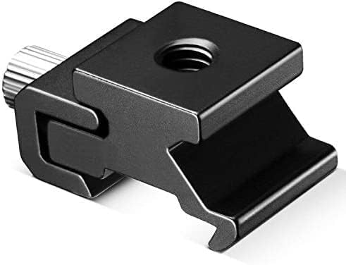  
</center>  
  
Test fit the hardware really quick on the cold shoe so you can understand how this works without the box being in the way.  
  
<center>  
  
</center>  
  
Now we're going to make a mark on the box by figuring out where the area is that the box can be balanced on the tripod. It's important to have the electronics and pegboard back in the box at this point to make things balanced. Find the point at which the box balances on the hardware freely.  
  
<center>  
  
</center>  
  
<center>  
  
</center>  
  
<center>  
  
</center>  
  
<center>  
  
</center>  
  
At this point, I drew a symbol resembling a centroid within the circle. Technically, the marked spot isn't a true centroid, as the center of mass doesn't perfectly align with where the centroid would be. The box has a non-uniform weight distribution, so the center of gravity and the centroid would fall in slightly different positions, though likely close to one another. While these concepts are distinct, for the purposes of this project, I will refer to the spot we marked as a centroid.  
<center>  
  
</center>  
  
Clamp it down so it doesn't move.  
  
<center>  
  
</center>  
  
Select a bit, which in this case is 15/64 inches. I apologize for those that use the metric system but I reside in a country where we have so much freedom that we are allowed to choose a poor unit of measure. I'm fairly sure a bald eagle loses a feather or something each time an American uses metric units. If you don't believe me, you can just finish building this project and get a picture of it happening yourself.  
<center>  
  
</center>  
  
<center>  
  
</center>  
  
Drill a hole within the center of the centroid and test fit the hardware.  
  
<center>  
  
</center>  
  
<center>  
  
</center>  
  
Cut a couple of squares from the end of our rubber strip to make our own gasket for this mounting hardware.  
<center>  
  
</center>  
  
Punch a hole in the squares with a hole punch, or in this case a leather hole punch that is 1/4 inch in diameter. For a leather hole punch, you just smack it on the back with a hammer and it cuts out a circle in the material. As the name implies, it's normally used as a leatherworking tool.  
  
<center>  
  
</center>  
  
<center>  
  
</center>  
  
<center>  
  
</center>  
  
Trim the external seal flush with the circular hardware fastener.  
  
<center>  
  
</center>  
  
<center>  
  
</center>  
  
Test fit the hardware with the seals and tighten it up.  
  
<center>  
  
</center>  
  
We can now assess how well the tripod supports the box and how easily it can be repositioned. This may be a good time to route any antennas through the ports on the top of the box. I routed the satellite notecard's antennas through the top and left the cell antennas inside, to be used on the side of the box.    
  
<center>  
  
</center>  
  
Next, we need to attach the box to a tree. While the tripod is useful for debugging, a trail camera is typically mounted to a tree or post. To do this, we'll modify the brackets to accommodate tie-down straps, as the existing holes in the enclosure's brackets are too small for the tie-down hooks.  
  
<center>  
  
</center>  
  
We're going to use a 27/64 inch drill bit in a drill press to mark how much bigger each hole needs to be.  
  
<center>  
  
</center>  
  
<center>  
  
</center>  
  
<center>  
  
</center>  
  
Swap out your drill bit for one designed to widen the hole more effectively. The bit I used wasn't hard enough and struggled to penetrate the material. A carbide bit, or one with similar hardness, would likely be more suitable for this job. The bit I used was tapered, and I applied oil while drilling to make cutting through the material easier.  
  
Please note that the bracket will heat up during drilling, so take proper safety precautions: wear gloves and safety glasses, and ensure that loose clothing or hair is secured.  
  
Consider whether the bracket could be recreated with a 3D printer instead of enlarging the holes through machining.  
  
<center>  
  
</center>  
  
File down the flashing that has appeared around the hole. It doesn't have to be perfect but this is to prevent injury from handling the bracket. 
  
<center>  
  
</center>  
  
Fasten the brackets to each of the back corners of the enclosure. There are pre-made holes for them on there.  
  
<center>  
  
</center>  
  
<center>  
  
</center>  
  
## Flash SD Card w/ Orange Pi  
  
Download a way to flash an image file, for example [balena etcher](https://etcher.balena.io/#download-etcher), [rufus](https://rufus.ie/en/), or [dd](./dd.md). For the sake of simplicity, we'll be using **balena etcher**.
  
Download the image file [over here](https://drive.google.com/file/d/1CXC_v6i8D2IcD96z8tGxYaPkZABNQrkC/view?usp=drive_link).  
  
Extract the folder and select the `.img` file within it from the `balena etcher` option to flash.  
  
<center>  
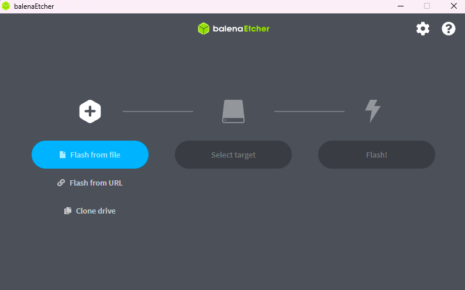  
</center>  
  
<center>  
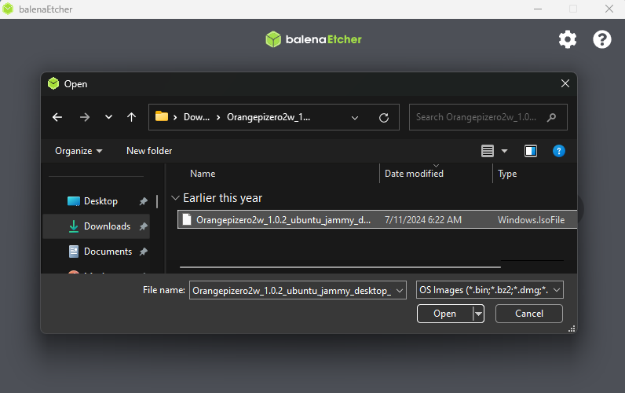  
</center>  
  
Insert your mini SD card within a card reader to your computer. Then select device and make sure it has the storage amount you would expect.  
  
<center>  
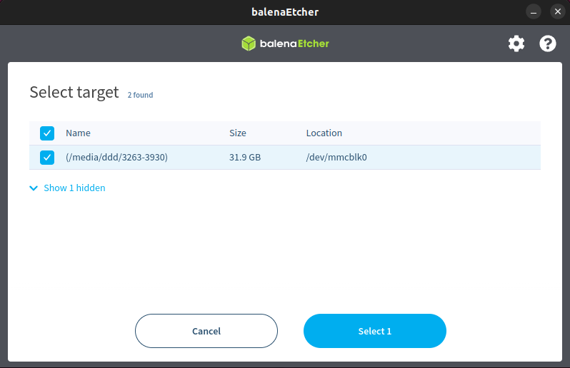  
</center>  
  
<center>  
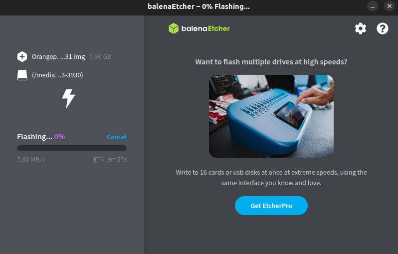  
</center>  
  
<center>  
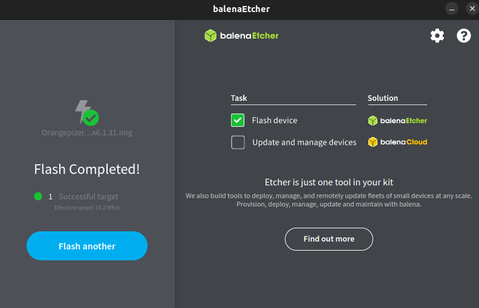  
</center>  
  
Insert the SD card into the Orange Pi and boot it up. Copy and paste the files from the firmware folder onto the Desktop of the Orange Pi.
  
<center>  
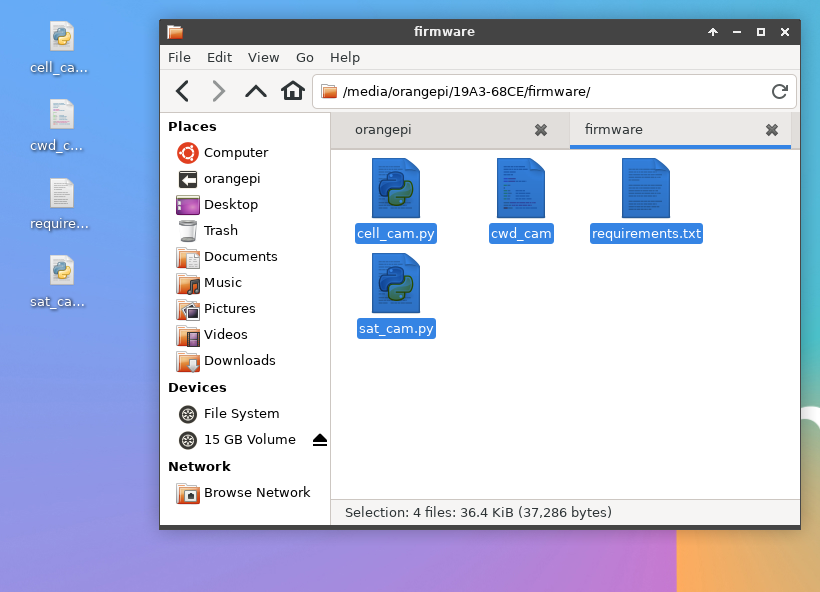  
</center>  
  
## Install Pip and Virtual Environment Module
  
Connect the Orange Pi to wifi and proceed to do the following commands within a terminal:  
  
```  
sudo apt-get update  
```  
  
```  
sudo apt update  
```  
  
```  
sudo apt install python3-pip  
```  
  
```  
sudo apt install python3-venv  
```  
  
## Install dependencies  
  
```  
python -m venv venv  
```  
  
```  
source ./venv/bin/activate  
```  
  
Navigate the terminal to the Desktop by doing `cd Desktop`.
  
```  
pip install -r requirements  
```  
  
## Setup init.d script to run at boot  
  
Edit the `cwd_cam` file with:  
  
```  
sudo nano cwd_cam  
```  
  
Change the script within `cwd_cam` from `cell_cam.py` to `sat_cam.py`. `cell_cam.py` is good for troubleshooting and is there for development purposes because satellite data can be costly.  
  
copy `cwd_cam` into the correct directory:  
  
```  
sudo cp cwd_cam /etc/init.d/  
```  
  
Update the permissions of the file:  
  
```  
sudo chmod +x /etc/init.d/cwd_cam  
```  
  
```
sudo chown root:root /etc/init.d/cwd_cam  
```  
  
Set it to run:  
  
```  
sudo update-rc.d cwd_cam defaults  
```  
  
You can check to see if it is running properly with the following commands after rebooting:  
  
```  
ps aux | grep cwd_cam  
```  
  
```  
ls -l /etc/rc*.d/*cwd_cam  
```  
  
You can also check the log for problems by using the following command:  
  
```  
cat /var/log/cwd_cam.log  
```    
  
## Setup Notehub Account  
  
**Create a notehub.io account and create a project:**  
  
<center>  
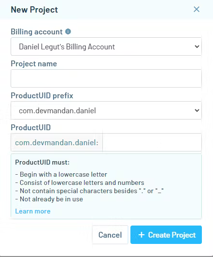  
</center>   
  
 **Copy the product UID.**  
  
<center>  
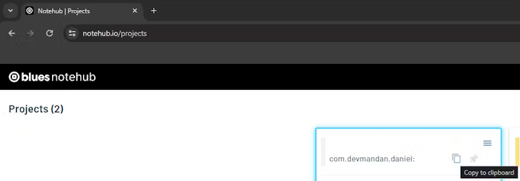  
</center>  
  
## Replace PRODUCT_UID value with your own in sat_cam.py  
  
<center>  
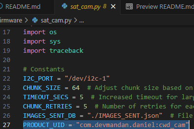  
</center>  
  
## Web Application  
  
Create your own fork of the repo and use it with digital ocean.   
  
1. Create a digital ocean account.  
2. Create a web service using the forked repo.  
3. Create a hosted PostgreSQL database.  
(SQLite won't work as a substitute due to locking entire tables while Postgres only does row-level locking. This is important for the resassembly of `base64` chunks of an image.)  
  
Use these settings for the web service:  
  
<center>  
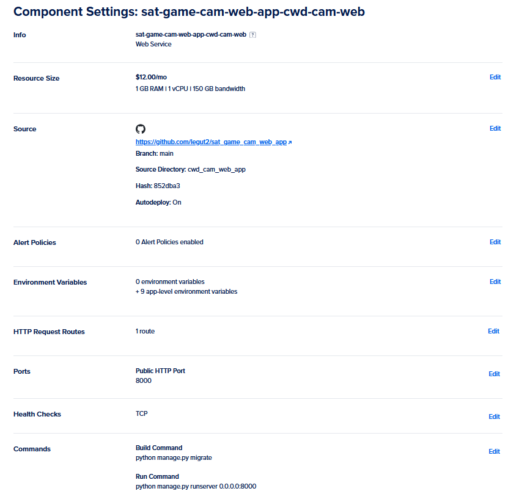  
</center>  
  
Within the web service you created within digital ocean, you'll want to use these settings:  
  
<center>  
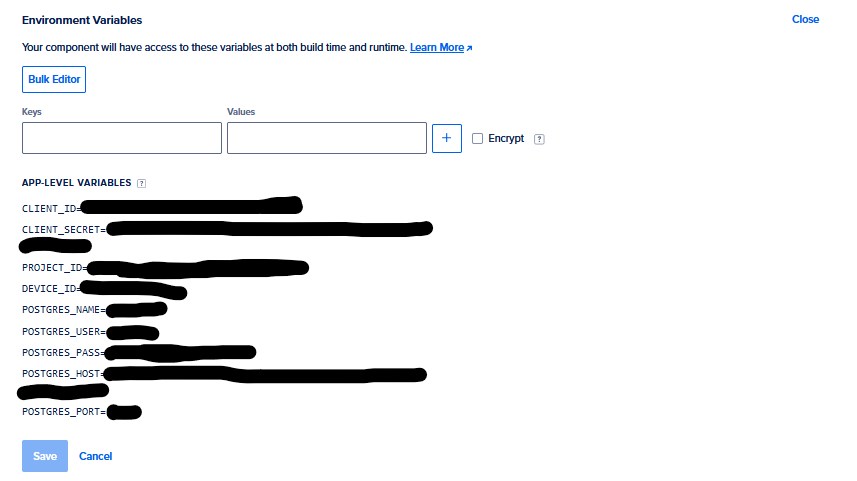  
</center>  
  
```  
Notehub Variables  
CLIENT_ID=xxxxxxxx-xxxx-xxxx-xxxx-xxxxxxxxxxxx  
CLIENT_SECRET=xxxxxxxxxxxxxxxxxxxxxxxxxxxxxxxxxxxxxxxxxxxxxxxxxxxxxxxxxxxxxxxx  
PROJECT_ID=xxxxxxxx-xxxx-xxxx-xxxx-xxxxxxxxxxxx  
DEVICE_ID=xxxxxxxxxxxxxxx  

Database Variables  
POSTGRES_NAME=xxxxxxxxx  
POSTGRES_USER=xxxxxxx  
POSTGRES_PASS=xxxxxxxxxxxxxxxxxxxxxxxx  
POSTGRES_HOST=db-postgresql-reg1-xxxxx-do-user-xxxxxxxx-0.g.db.ondigitalocean.com  
POSTGRES_PORT=25060  
```  
  
You can grab the first four values from notehub.io  
  
#### Create `CLIENT_ID` and `CLIENT_SECRET` within notehub.io
Navigate to your dashboard and click on settings.  
<center>  
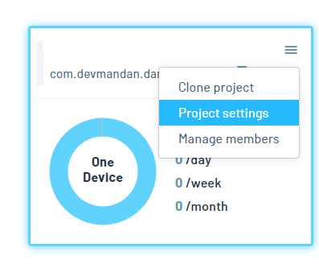  
</center>  
  
<center>  
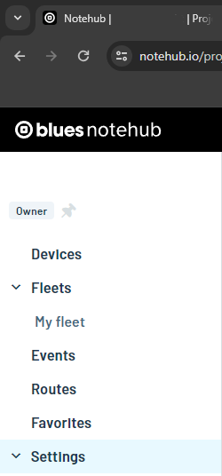  
</center>  

Now go ahead and scroll down through your and click on `Generate programatic access`, copy the credentials into environment variables, and click save within the settings!

<center>  
  
</center>  

#### Find `PROJECT_ID` and `DEVICE_ID`

Scroll all the way back up and copy over the `Project UID` without the `app:` over to your environment variable for `PROJECT_ID`. You can also see this as part of the URL within your web browser's address bar.

<center>  
  
</center>  

Lastly, click onto `Devices` and copy over the relevant ID under the `Best ID` column for `DEVICE_ID` within the `.env` file.

<center>  
  
</center>  

Fill out the remaining postgres related environment variables from the postgres database you setup. `POSTGRES_NAME` is the `database` value in the image below. You will also want to download and copy the certificate into `cwd_cam_web_app/certs/`. This certificate allows for the database to be connected to over SSL.  
  
<center>  
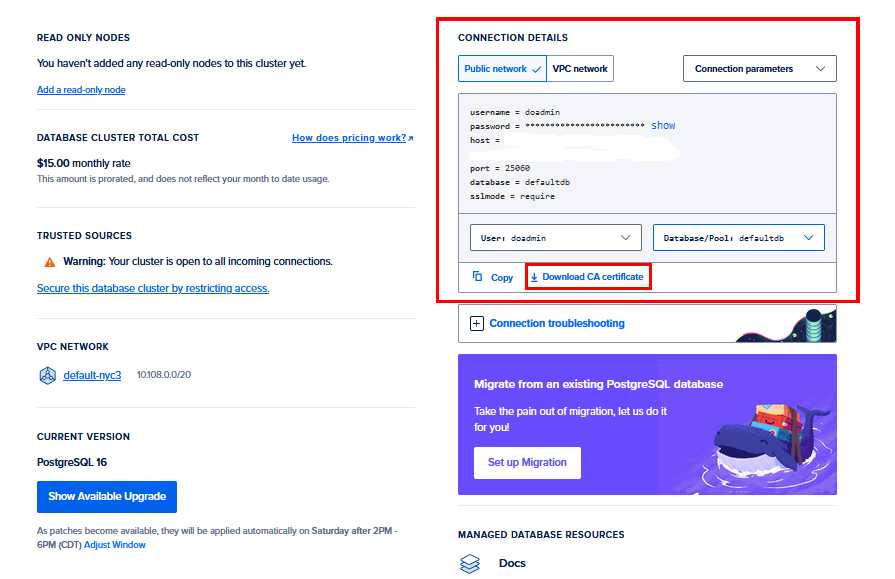  
</center>  
  
You'll want to make sure to route the events within Notehub to go to your web application. Make sure to route to the `/api/images/` endpoint within your hosted web application.  
  
<center>  
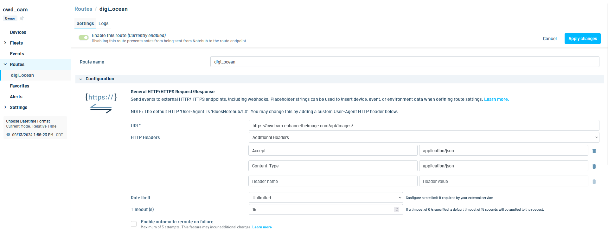  
</center>  
  
Select `data.qo` and `sat.qo` as the notefiles to send to that API endpoint.  
  
<center>  
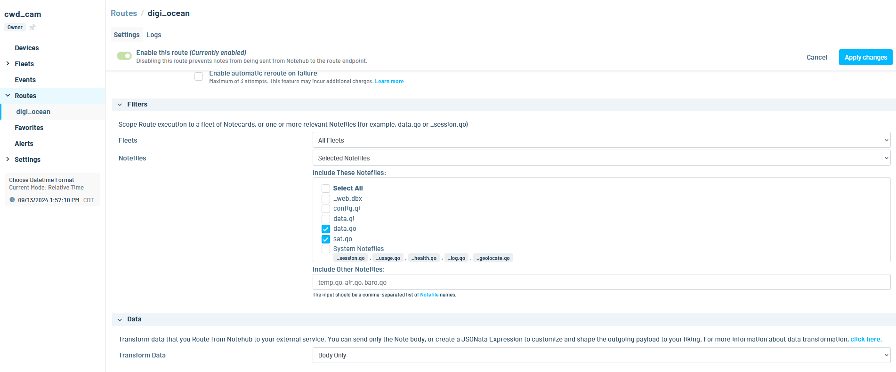  
</center>  
  
Make sure to only send the body of the data and transform it prior to sending.  
  
# Now We're All Set to Start Taking Images!  
  
<center>  
  
</center>  
  
<center>  
  
</center>  
  
<center>  
  
</center>  
  
<center>  
  
</center>  
  
<center>  
  
</center>  